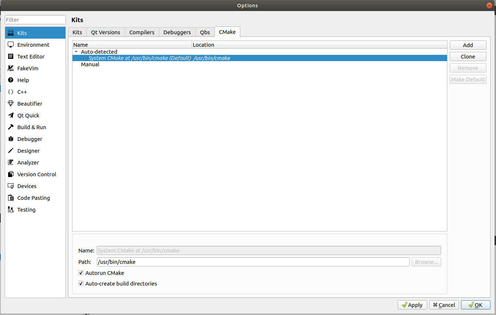
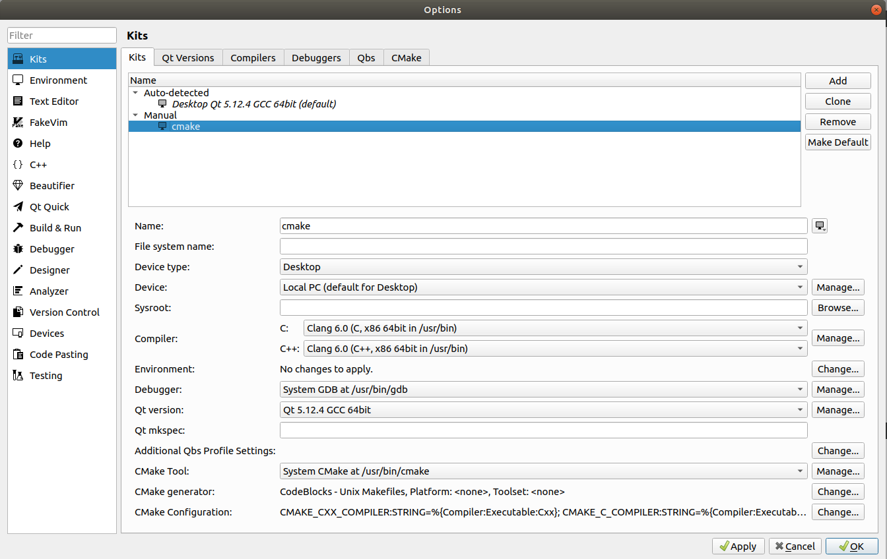
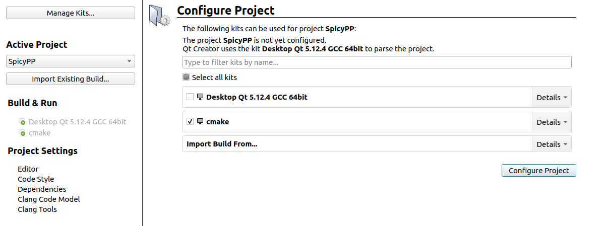
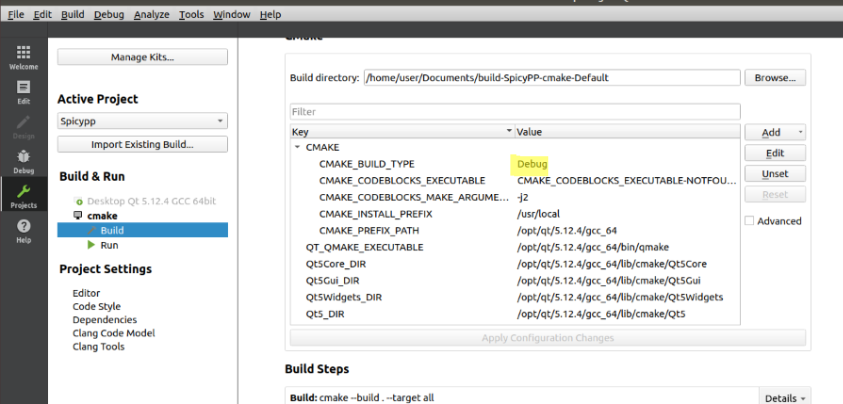

# Installing Qt developement environement
To get the project running on the QT editor on the EmbSw ubuntu VM please read the following instructions.
## 1. CMake 
  For QT to run Cmake, it must know its installation. To ensure this go to Tools -> Options -> Kits -> Cmake. It should look like this
  
  
## 2. New Kit
  Now we want to make an new kit because compilation fails with QT's own kit. Go to tab Kits -> Add put in the following configurations:
  

## 3. Import project
  To import project, go to File->Open File or Project and select the CMakeLits.txt file in the repository. In the following window select the newly created Kit as Kit for the       Project.
  
  
## Programming with CMake
Since the Editor doesnn't add new files automatically to the CMakeList you must do it manually. If you add a .cpp or .ui file in the src add the file to the "add_executable" list. If the File is part of th backend, add its path to add_library after Static. The corresponding headerfile of a cpp file mustn't be added.
```Cmake
add_library(matrix STATIC src/Backend/Matrix.cpp)
add_executable(spicy src/SpicyPP.cpp
                     src/MainWindow.cpp
                     src/MainWindow.ui)
```
Adding foo.cpp/h in src, and bar.cpp/h in src/backend:
```Cmake
add_library(matrix STATIC src/Backend/Matrix.cpp
                          src/Backend/bar.cpp)
add_executable(spicy src/SpicyPP.cpp
                     src/MainWindow.cpp
                     src/MainWindow.ui
                     src/foo.cpp)
```

## Debug config
To enable debug. Add the following value to the marked place:
  
